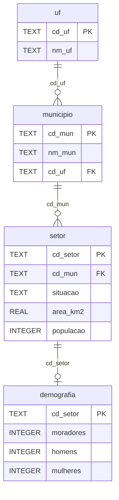

# Banco de dados: mapeamento

> Levantamento feito em 2026-09-25 sobre `data/censo.sqlite`.
> Decisão de localização e versionamento: [ADR 0001](decisions/0001-banco-de-dados-sqlite.md).
> Índices e desempenho: [indexes.md](indexes.md).

## Visão geral

| Item | Valor |
|---|---|
| Arquivo | `data/censo.sqlite` (~35 MB, Git LFS) |
| Motor | SQLite 3 |
| Page size | 4096 bytes (8.593 páginas, 0 livres) |
| `journal_mode` | `delete` (padrão) |
| `auto_vacuum` | 0 (desligado) |
| `user_version` | 0 (sem controle de versão de schema) |
| `integrity_check` | ok |
| `foreign_key_check` | 0 violações |
| Índices secundários | nenhum |
| Estatísticas (`ANALYZE`) | não geradas |

Todas as tabelas são `WITHOUT ROWID`: os dados ficam fisicamente ordenados pela
chave primária (índice clusterizado). Buscas e intervalos pela PK não precisam
de índice adicional.

## Diagrama



## Hierarquia dos códigos

Os códigos são hierárquicos. Cada nível começa com o código do nível acima:

```
UF        35
Município 35 50308                 (7 dígitos)
Setor     35 50308 05 00 0001      (15 dígitos)
          │  │     │  │  └─ setor
          │  │     │  └─ subdistrito
          │  │     └─ distrito
          │  └─ município
          └─ UF
```

Consequência prática: todos os setores de um município estão em um intervalo
contíguo da chave primária de `setor` (ver [indexes.md](indexes.md)).

## Tabelas

### uf (27 linhas, ~4 KB)

| Coluna | Tipo | Nulo | Descrição |
|---|---|---|---|
| `cd_uf` | TEXT | PK | Código IBGE da UF, 2 dígitos |
| `nm_uf` | TEXT | não | Nome da UF |

### municipio (5.571 linhas, ~160 KB)

| Coluna | Tipo | Nulo | Descrição |
|---|---|---|---|
| `cd_mun` | TEXT | PK | Código IBGE do município, 7 dígitos |
| `nm_mun` | TEXT | não | Nome do município |
| `cd_uf` | TEXT | não | FK para `uf` |

### setor (468.099 linhas, ~21 MB)

| Coluna | Tipo | Nulo | Descrição |
|---|---|---|---|
| `cd_setor` | TEXT | PK | Código do setor censitário, 15 dígitos |
| `cd_mun` | TEXT | não | FK para `municipio` |
| `situacao` | TEXT | sim | `Urbana` (354.965) ou `Rural` (112.031); nulo em 1.103 |
| `area_km2` | REAL | não | Área em km² (0,00015 a 38.943) |
| `populacao` | INTEGER | não | População do setor (0 a 10.163) |

### demografia (458.772 linhas, ~12 MB)

| Coluna | Tipo | Nulo | Descrição |
|---|---|---|---|
| `cd_setor` | TEXT | PK | FK para `setor` (relação 1:0..1) |
| `moradores` | INTEGER | sim | Total de moradores |
| `homens` | INTEGER | sim | Moradores homens |
| `mulheres` | INTEGER | sim | Moradoras mulheres |

## Qualidade dos dados

Totais: 203.080.756 pessoas somando `setor.populacao`.

| # | Achado | Quantidade | Observação |
|---|---|---|---|
| 1 | Município com código `.`, nome vazio, UF 43 (RS) | 1 | Tem 2 setores (`4300001…`, `4300002…`) com população 0 e áreas de 2.884 e 10.201 km². Hipótese: áreas sem município, como Lagoa Mirim e Lagoa dos Patos. A confirmar. |
| 2 | `setor.situacao` nulo | 1.103 | Todos com população 0 |
| 3 | Setor sem linha em `demografia` | 9.327 | Exatamente os setores com população 0 |
| 4 | `demografia.moradores` nulo com população > 0 | 8.684 | Provável sigilo estatístico na origem |
| 5 | `homens` ou `mulheres` nulo com `moradores` preenchido | 56 | Idem |
| 6 | `setor.populacao` igual a `demografia.moradores` | 100% dos casos preenchidos | Dado redundante entre as tabelas |
| 7 | Nomes de município repetidos | 232 nomes | Buscar sempre por código ou por nome + UF |
| 8 | `moradores = homens + mulheres` | 0 divergências | Consistente |
| 9 | Prefixo de setor diferente do município | 2 | Apenas os setores do achado 1 |

## Melhorias identificadas

Nenhuma foi aplicada. Cada uma, se adotada, vira um ADR e é aplicada via
migration.

| Melhoria | Motivo |
|---|---|
| `PRAGMA foreign_keys = ON` em toda conexão | O SQLite não valida FKs por padrão; com escrita pela aplicação, dados órfãos passariam |
| `PRAGMA journal_mode = WAL` | Permite leituras simultâneas a uma escrita; recomendado para aplicação com leitura e escrita |
| Usar `user_version` para versionar o schema | Hoje é 0; base para migrations |
| `CHECK (situacao IN ('Urbana','Rural'))` | Restringe valores; exige recriar a tabela no SQLite |
| Tratar o município `.` (achado 1) | Definir se é mantido, renomeado ou marcado como área especial |
| Rodar `ANALYZE` após criar índices | Dá estatísticas ao otimizador de consultas |
| Decidir sobre a redundância `populacao`/`moradores` | Com escrita, os dois valores podem divergir |
